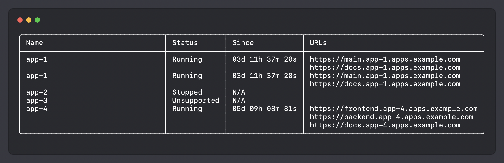
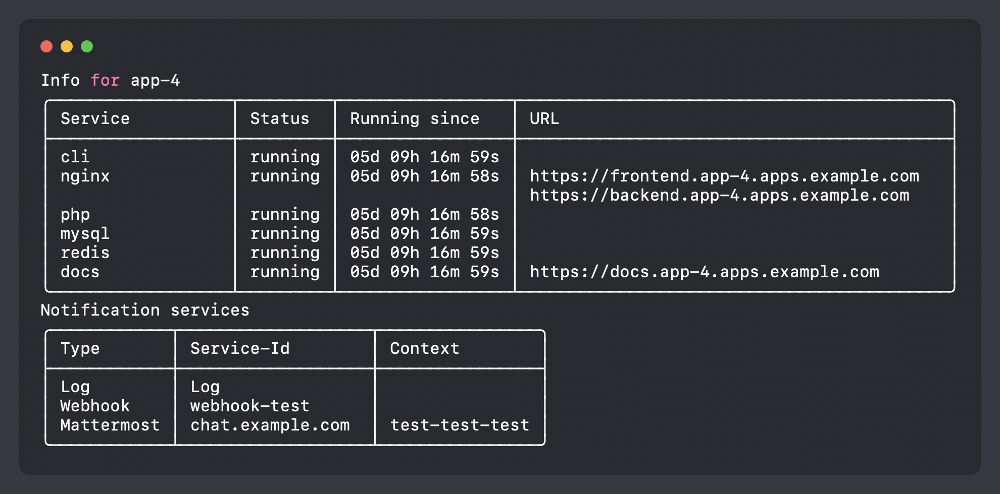

# the cli

The cli provides a thin wrapper to access the rest-api of scotty. It is
written in rust and provides a simple interface to list, create, update and
destroy apps. You can get some helps by running `scotty --help` and
`scotty --help <command>`.

## List all apps

```shell
scotty --server <SERVER> --token <TOKEN>t app:list
```

Example-output:



The table contains all apps with their status, uptime and urls. The urls are the
public urls of the apps. The status can be one of the following:

* Running: The app is running
* Stopped: The app is stopped
* Unsupported: The app is not supported by the server

## Get info about an app

```shell
scotty --server <SERVER> --token <TOKEN> app:info <APP>
```

Example-output:



The command list all services of a specific app and their status. The output
contains also the enabled notification services for that app.
