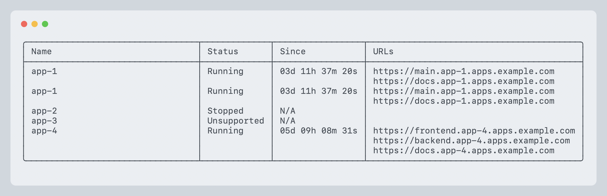
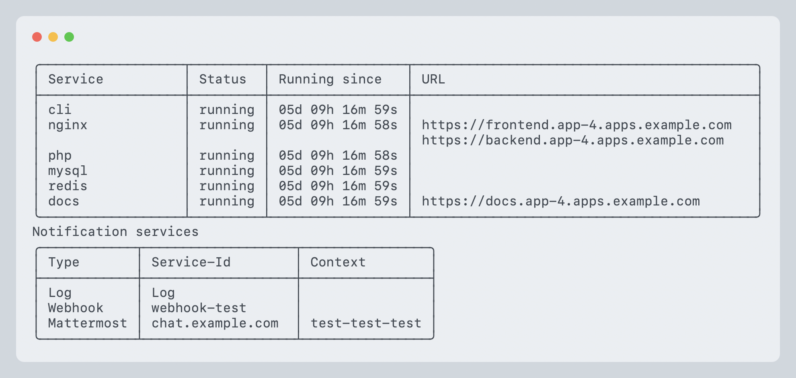

# The command line interface

The CLI provides a thin wrapper to access the REST API of Scotty. It is
written in Rust and provides a simple interface to list, create, update and
destroy apps. You can get help by running `scottyctl --help` and
`scottyctl --help <command>`.

## List all apps

```shell
scottyctl --server <SERVER> --access-token <TOKEN> app:list
```

Example output:


The table contains all apps with their status, uptime and URLs. The URLs are the
public URLs of the apps. The status can be one of the following:

* Running: The app is running
* Stopped: The app is stopped
* Unsupported: The app is not supported by the server

## Get info about an app

```shell
scottyctl --server <SERVER> --access-token <TOKEN> app:info <APP>
```

Example output:


The command lists all services of a specific app and their status. The output
also contains the enabled notification services for that app.

## Start/run an app

```shell
scottyctl --server <SERVER> --access-token <TOKEN> app:start <APP>
scottyctl --server <SERVER> --access-token <TOKEN> app:run <APP>
```

The command will start an app and print the output of the start process. After
the command succeeds, it will print the app info.

## Stop an app

```shell
scottyctl --server <SERVER> --access-token <TOKEN> app:stop <APP>
```

The command will stop an app and print the output of the stop process. After
the command succeeds, it will print the app info.

## Rebuild an app

```shell
scottyctl --server <SERVER> --access-token <TOKEN> app:rebuild <APP>
```

The command will rebuild an app and print the output of the rebuild process.
Part of the rebuild process is rewriting the proxy configuration, pulling new
images for the app and rebuilding local images if necessary. The app itself will
also be powered off and on again.

## Purge an app

```shell
scottyctl --server <SERVER> --access-token <TOKEN> app:purge <APP>
```
The command will purge all temporary data of an app, especially logs,
temporary docker containers and other ephemeral data. It will not delete any
persistent data like volumes or databases. If the app was running, it will be
stopped by this command.

## Create an app

```shell
scottyctl --server <SERVER> --access-token <TOKEN> app:create <APP> --folder <FOLDER> \
  --service <SERVICE:PORT> [--service <SERVICE:PORT> ...] \
  [--app-blueprint <BLUEPRINT>] [--ttl <LIFETIME>] \
  [--basic-auth <USERNAME:PASSWORD>] [--allow-robots] \
  [--custom-domain <DOMAIN:SERVICE>] [--custom-domain <DOMAIN:SERVICE> ...] \
  [--env <KEY=VALUE>] [--env <KEY=VALUE> ...] \
  [--registry <REGISTRY>]
```

This command will create a new app on the server. The `--folder` argument is
mandatory and should point to a folder containing at least a `docker-compose.yml`
file. The complete folder will be uploaded to the server (size limits may apply).

You either need to declare a public service via `--service` or use the
`--app-blueprint` argument (You can get a list of available blueprints with
`scottyctl blueprint:list`). When declaring a public service, you need to
provide a service name and a port. The service name should match a service in the
docker-compose.yml file. The port should be the port the service is listening on.

The `--ttl` argument is optional and will set the lifetime of the app in hours,
days or forever.

You can add basic auth to the app with the `--basic-auth` argument. The argument
should contain a username and a password separated by a colon.

The `--allow-robots` argument will inject a `X-Robots-Tag: noindex` header into
all responses of the app. This will prevent search engines from indexing the app.
(Not supported by all proxies)

You can add custom domains to the app with the `--custom-domain` argument. The
argument should contain a domain and a service name separated by a colon. The
service name should match a service in the docker-compose.yml file.

You can add environment variables to the app with the `--env` argument. The
argument should contain a key and a value separated by an equal sign. You can
reference secrets from 1Password with the `OP`-uri-scheme. The value should be
a URL like `op://<connect-instance-name>/<vault-uuid>/<item-uuid>/<field-name>`.
The server needs to be configured accordingly.

You can use a private registry for the images with the `--registry` argument. The
argument should contain the name of the registry. The server needs to be
configured accordingly.

### Some examples:

```shell
scottyctl --server <SERVER> --access-token <TOKEN> app:create my-nginx-test \
  --folder . \
  --service nginx:80
```

will beam up the current folder to the server and start the nginx service on port 80.

```shell
scottyctl --server <SERVER> --access-token <TOKEN> app:create my-nginx-test \
  --folder . \
  --service nginx:80 \
  --basic-auth user:password \
  --allow-robots \
  --ttl forever
```

will beam up the current folder to the server and start the nginx service on port 80.
It will add basic auth with the username `user` and the password `password` and
won't add a `X-Robots-Tag` header to all responses. The app will run forever.

```shell
scottyctl --server <SERVER> --access-token <TOKEN> app:create my-nginx-test \
  --folder . \
  --service nginx:80 \
  --custom-domain nginx.example.com:nginx
```

will beam up the current folder to the server and start the nginx service on port 80.
The app will be reachable under `http://nginx.example.com`.

## Adopt an app

```shell
scottyctl --server <SERVER> --access-token <TOKEN> app:adopt <APP>
```

This command will adopt an unsupported app. For this to work, the app needs to
be already in the server's app directory. The command will create a `.scotty.yml`
file in the app directory and add the app to the server's database.

Scotty will also try to reuse the existing config from the load balancer and add
that information to the `.scotty.yml` file. It will also dump all found
environment variables into the `.scotty.yml` file.

After adopting an app, it is strongly advised to check the `.scotty.yml` file and
remove any unnecessary information from it and double-check the configuration.

## Destroy an app

```shell
scottyctl --server <SERVER> --access-token <TOKEN> app:destroy <APP>
```

This command will destroy only a supported app. It will stop the app, remove
all ephemeral and persistent data and remove the app from the Scotty server.
It will also delete the used images if they are not used somewhere else.

Caution: This command is irreversible! You might lose data if you run this command.

## List all blueprints

```shell
scottyctl --server <SERVER> --access-token <TOKEN> blueprint:list
```

This will list all available blueprints on the server.

## Add a notification service to an app

```shell
scottyctl --server <SERVER> --access-token <TOKEN> notify:add <APP> \
  --service-id <SERVICE_TYPE://SERVICE_ID/CHANNEL|PROJECT_ID/MR_ID>
```

This command will add a notification service to an app. That means scotty will
send a notification for every action on that app to the selected service. The
service needs to be configured on the server.

Currently there are three service types available:
  * `mattermost://SERVICE_ID/CHANNEL`: Send a message to a mattermost channel
  * `gitlab://SERVICE_ID/PROJECT_ID/MR_ID`: Add a comment to a gitlab merge request
  * `webhook://SERVICE_ID`: Send a webhook to a configured URL

## Remove a notification service from an app

```shell
scottyctl --server <SERVER> --access-token <TOKEN> notify:remove <APP> \
  --service-id <SERVICE_TYPE://SERVICE_ID/CHANNEL|PROJECT_ID/MR_ID>
```

This command will remove a notification service from an app. The format of
`SERVICE_ID` is the same as in the `notify:add` command.

## List all notification services of an app

```shell
scottyctl --server <SERVER> --access-token <TOKEN> app:info <APP>
```

For more info, see the help for [`app:info`](http://localhost:8080/cli.html#get-info-about-an-app).
